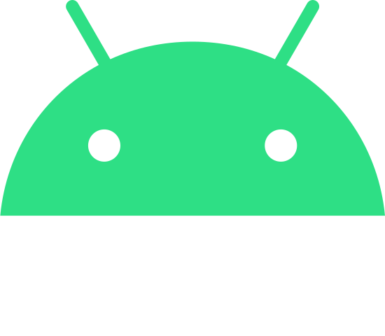
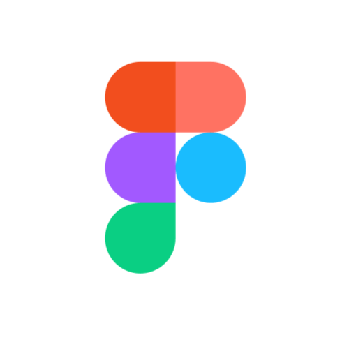

I am an Android Developer. I have knowledge of Java and especially in Kotlin, MVVM Pattern, Android SDK’s and Firebase. I am passionate love to code and in the Android application development using the best practices recommended by Google with the cleanest code possible. Predisposed to improve and add new experiences to enhance  my skills, both technical and soft. 

Languages and Tools:

